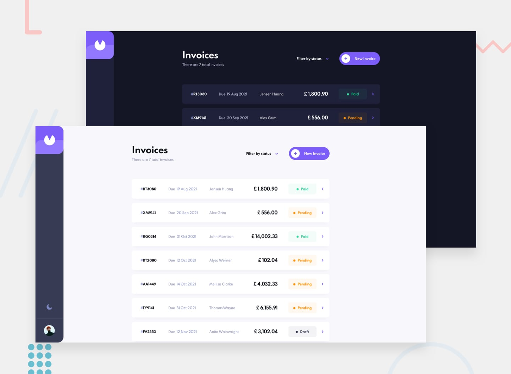

# Invoice App - Frontend Mentor

## Intro

Hello, there! 👋

Thank you for checking out my solution to the [invoice app challenge](https://www.frontendmentor.io/challenges/invoice-app-i7KaLTQjl) from Frontend Mentor. 😀

Feel free to look around and explore! 😉

## Overview

For this challenge, I used...

- React and Next.js (to build out the site)
- styled-components (to style it) 
- Formik and Yup (to handle the forms in the site)
- Framer Motion (for the page transitions and animations)

...and one or two other libraries to simplify things like working with dates and local storage. 😁

## Things I Learned

This was my first time using all of these libraries/packages (besides React), so I learned a lot! Besides learning those new tools, I realized how important it is to stay organized and write code that is clean and reusable, especially as the project you're working on grows larger.

On that note—I was kind of lost when it came to structuring and organizing a larger project like this, so I don't know how clean or reusable my code is and I might have come up with my own way of doing things here and there. I'd like to improve, however, so feedback is welcome!

## Things I Wish I Would Have Done

- Probably thought a little bit more about how to structure my styles before I started!
- Perhaps broken down a couple of large components a little more. 
- And maybe used CSS variables to create the light/dark modes of the site (rather than styled-components' theme provider). I think it might have been a little... easier.

## Bugs

- There's a quick flash of light mode that appears before the page transitions to dark mode when the page loads if the theme stored in local storage is dark mode. This is because of Next.js's pre-rendering feature and I haven't worked on a solution for that yet.
- I made a custom dropdown menu for the filter on the home page but I don't think it's very accessible. I tried to use labels and checkboxes to improve its accessibility, but IDK if that made it worse. 
- The package I used to disable scrolling takes into account the extra space created by removing the scroll bar in the desktop layout but not tablet/mobile layouts, leaving a tiny bit of space between the content of the page and edge of the screen in the tablet/mobile layout.
- There might be other bugs, too, that I might have missed, so let me know if you find them!